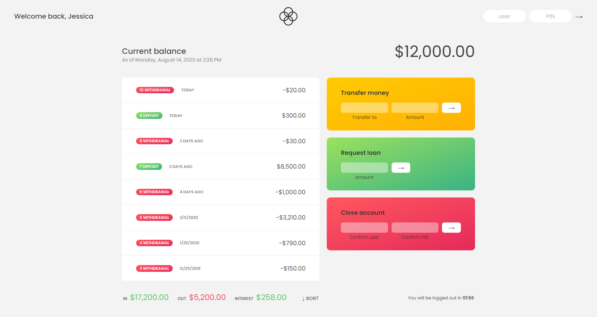

# Bankist Project - Udemy JavaScript Course

## Description

This repository contains the project "Bankist" developed as part of [The Complete JavaScript Course 2023: From Zero to Expert!](https://www.udemy.com/course/the-complete-javascript-course/) course on Udemy. The Bankist project is a simple banking application that allows users to perform basic banking operations like depositing money, withdrawing money, transferring money between accounts, and requesting a loan.

## Features

- User Authentication: Users can log in using their account number and PIN.
- Account Dashboard: After login, users can view their account details, transactions, and current balance.
- Deposit: Users can deposit money into their account.
- Withdraw: Users can withdraw money from their account.
- Transfer: Users can transfer money from their account to another user's account.
- Loan Request: Users can request a loan and the system will process the request based on their account balance and loan conditions.
- Close Account: Users can close their account.

## Technologies Used

- HTML5 and CSS3 for the user interface.
- JavaScript for the application's logic.
- Vanilla JavaScript is used, without any libraries or frameworks.
- The project was developed following modern JavaScript practices and principles, including ES6 features.

## Getting Started

To run the Bankist project, simply clone this repository to your local machine and open the `index.html` file in your web browser.

## Project Structure

The project follows a simple structure:

- `index.html`: The main HTML file for the project.
- `style.css`: The CSS file for styling the user interface.
- `script.js`: The main JavaScript file containing the application logic.
- `img`: A directory containing images used in the project.

## Credits

The Bankist project was created as part of [The Complete JavaScript Course 2023: From Zero to Expert!](https://www.udemy.com/course/the-complete-javascript-course/) course on Udemy, instructed by [Jonas Schmedtmann](https://www.udemy.com/user/jonasschmedtmann/). The design, code, and concepts are based on the course content.
